## Introduction
Link to gitHub:
<a href="https://github.com/gretazas/aSchooler">https://github.com/gretazas/aSchooler</a>

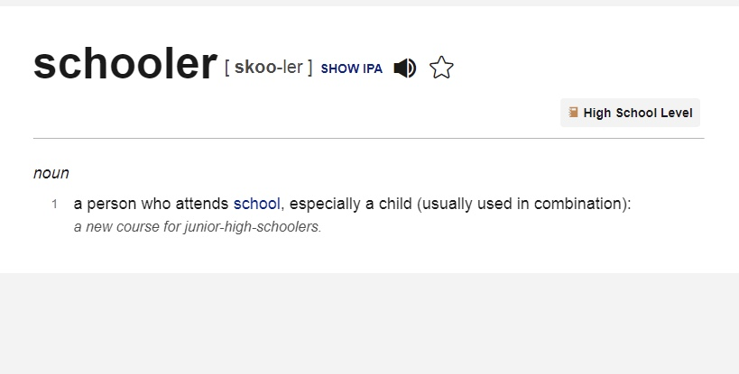

## Table of Contents
* [Project Planning](#project-planning)
* [Agile](#agile)
    * [User Stories](#user-stories)
    * [Project Scope](#project-scope)
    * [Project Dtabase Scope](#project-database-scope)
    * [Project Setup](#project-setup)
    * [Project Management](#project-management)
* [Features](#features)
    * [Products](#products)
    * [Create An Account](#create-an-account)
    * [Create an order](#create-an-order)
    * [View an order](#view-an-order)
    * [View Your order history](#view-your-order-history)
    * [Delete Items](#delete-items)
    * [Create Your Profile](#create-your-profile)
    * [Edit Your Profile shipping details](#edit-your-profile-shipping-details)
    * [Admin](#admin)
* [Features - Features Left To Implement](#features-left-to-implement)
* [Basic Wireframe Design](#basic-wireframe-design)
    * [Landing Page Wireframe](./extrareadme.md)
    * [Products Page Wireframe](./extrareadme.md)
    * [Product Detail Page Wireframe](./extrareadme.md)
    * [Shopping Cart Wireframe](./extrareadme.md)
    * [Mix And Match Products Wireframe](./extrareadme.md)
                
* [Kanban Example](#kanban-example)
* [Web Marketing](#web-marketing)
* [Business model documentation](#Business-model-documentation)
* [SEO Optimization](#seo-optimization)
* [Stripe payments](#stripe-payments)
* [Testing](#testing)
    * [Automated Testing](#automated-testing)
    * [Django Coverage report](#django-coverage-report)
    * [Manual Testing](#manual-testing)
    * [Pep8 and Pylint Python Validators](#pep8-and-pylint-python-validators)
    * [HTML Validation with Official W3C Validator](#html-validation-with-official-w3c-validator)
    * [CSS Validation with Official W3C Validator](#css-validation-with-official-w3c-validator)
    * [LightHouse testing](#lighthouse-testing)
    * [Responsive testing](#responsive-testing)
* [Bugs](#bugs)
* [Existing Bugs](#existing-bugs)
* [Deployment](#deployment)
* [Deployment on Heroku](#deployment-on-heroku)
* [Heroku Deployment - Setting up AWS](#heroku-deployment---setting-up-aws)
* [MVT Architecture](#mvt-architecture)
* [Django AdminUser](#django-adminuser)
* [Used Technologies](#used-technologies)
* [Frameworks and Libraries used](#frameworks-and-libraries-used)
* [Credits](#credits)

## Project Planning

* Create wireframes as sketches.
    -   Imagination realization

* Create wireframes with figma.com
    -   Imagination realization in digital

* Create user stories
    -   To get an idea of site usage purposes and features

* Create some parts of readme.md file
    -   To get mentor's approval to start the project

* Create this project plan
    -   Get a straight idea of what to do and when

* Create a new repository on GitHub
    -   Use Code Institute`s  full template

* Start project
    -   Initial Commit

* Use user stories creating project as guidance
    -   Easy to organize work with and commit messages

* Have access to secure checkout.
    -   Using Stripe.

* Admin access to all products, orders, and shipping details.
    -   Admin access allows you to view orders.

## Agile

* [Basic Wireframe Design](./extrareadme.md)
* [Kanban Example](#kanban-example)

## User Stories

* Viewing and navigation

    * As a Shopper I can View a list of products so that I can Select some to purchase
    * As a Shopper I can View individual product details so that I can Find out about the product price, product itself, rating, view image, search for right sizes
    * As a Shopper I can Easy view the total of all purchases at all times so that I can Easy to see how close I am to the spending limit

* Registration and User Accounts
    * As a Site User I can Register to the Account so that I can Have a personal account i can view my profile, order history, saved shipping and billing details
    * As a Site Member I can Easy to login or logout so that I can Access my personal account information
    * As a Site Member  I can Easily recover  password so that I can Recover access to my account if needed 
    * As a Site Member I can Receive an email conformation after registering so that I can have reinsurance that registration was successful

* Sorting and searching
    * As a Shopper I can Sort the list of products so that I can Easily identify the best-rated products, and sort them by preference 
    * As a Shopper I can Sort specific categories of product so that I can Find best priced or best-rated products
    * As a Shopper I can Find the product by name or description so that I can Find specific product to purchase
    * As a Shopper I can Easily see what I've searched for and how many items found
    * As a Site Member I can access the page with the matching feature so that I can compare in-color products to match them

* Purchasing and Checkout
    * As a Shopper I can Easily select the size and quantity of the product when purchasing it so that I can Ensure I've selected the right products
    * As a Shopper I can Have access to secure checkout so that I can feel safe and pay with ease

## Project Scope

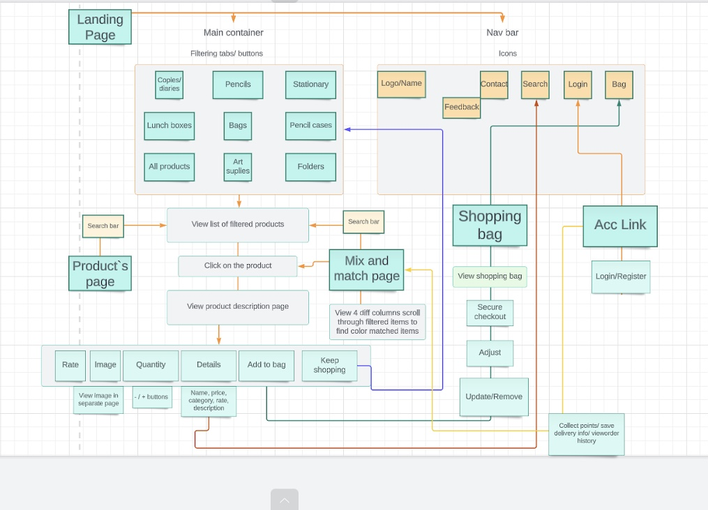

## Project Database Scope

Product/Category Model:

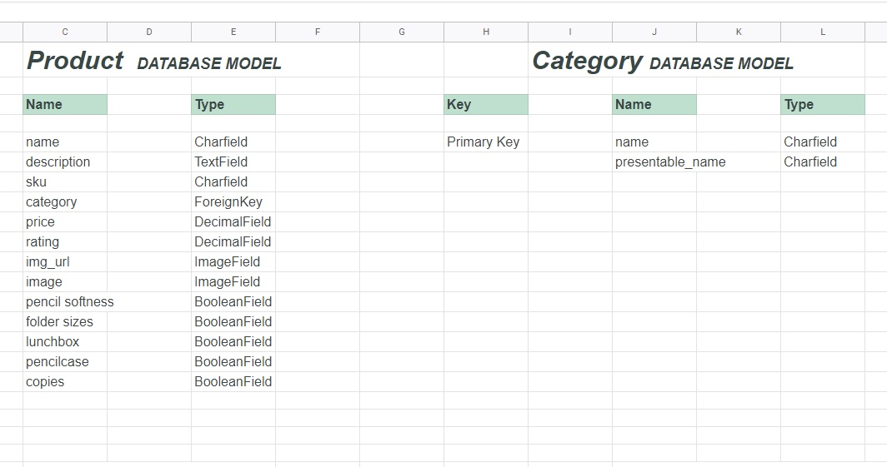

Order/LineItems Model:

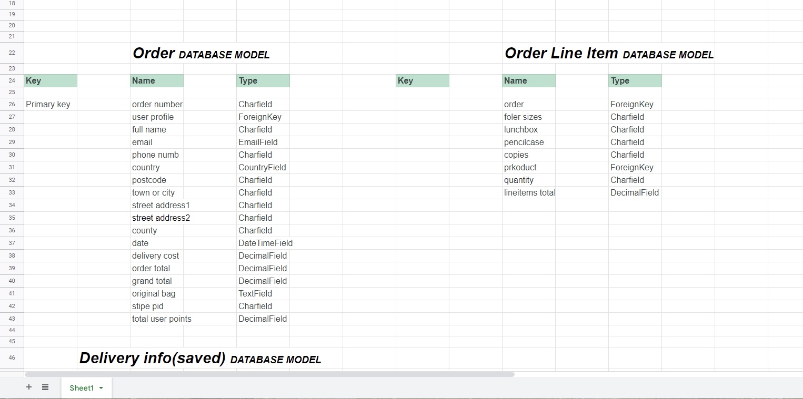

Feedback Model:

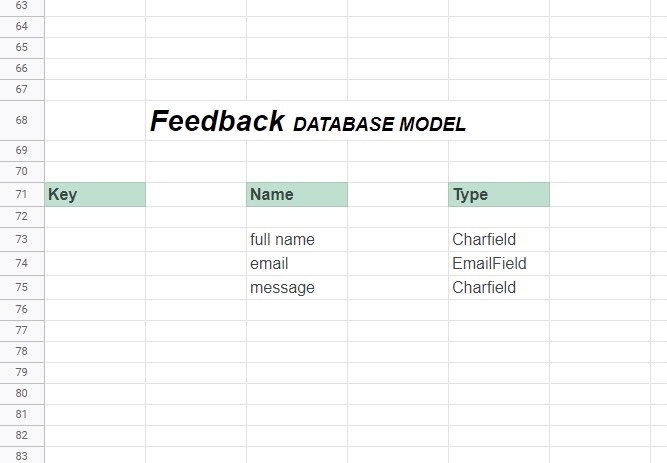

Rate Product Model:

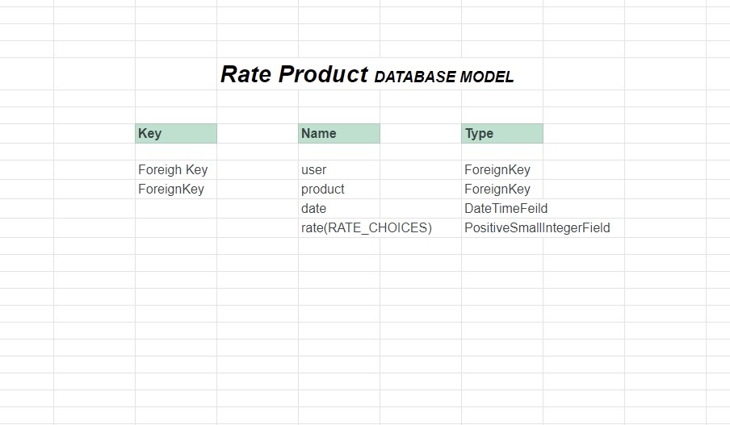

Collect Points Model:

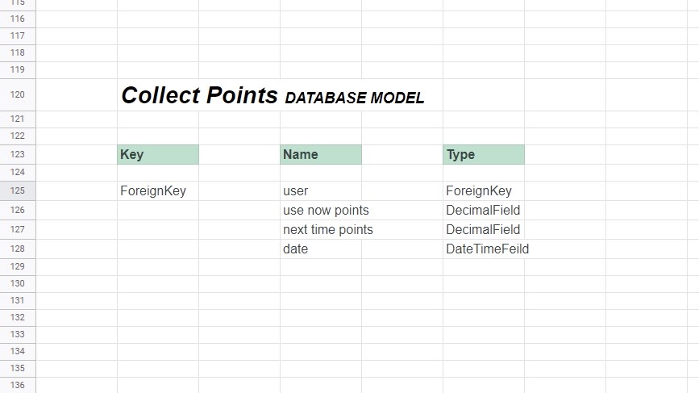

(<a href="#top">Back to top</a>)

## Project Setup

## Project Management
GitHub's KanBan board to manage my workflow. 
* Three columns:
    - todo
    - in progress
    - done

The board allowed me to easily drag my stories through the business delivery lifecycle of: To Do -> In Progress -> Completed.

## Features

View different greetings on different time of the year:
    Import:
        - datetime
        - pandas as pd
            - start = datetime.datetime.strptime("01-12-2021", "%d-%m-%Y")
            - end = datetime.datetime.strptime("07-12-2021", "%d-%m-%Y")
            - date_generated = pd.date_range(start, end)
                - Greatings according to season:
                - if September f"Back to School!"
                - elif December f"Happy Christmas!!!"
                - elif February f"Happy Valentine`s Day!"
                - elif March/april f"Happy Easter!"
                - elif August f"Sale! 10% off with any purchase!"
                - else f"delivery free with purchase of {{ FRE_DELIVERY_TRESHOLD}}€!"

### Products
- Filter products by categories 
- View product detail
- Rate product
- Save product purchase history
- Save purchased product saving points histopy

### Create An Account
- Create save account with email varification.

### Create an order
- Create and order after clicking checkout and see them in profile later.

### View an order
- View your order and collect points history in profile page

### View Your order history
Users have an ability to view their own order history.

### Delete Items
By setting your quantity to 0 user deletes the item from the order line items.

(<a href="#top">Back to top</a>)

### Create Your Profile
- Create account for ability to rate product
- Save points, one point per one euro from every purchase
- Save information for next purchase itme

### Edit Your Profile shipping details
- Easily edit profile information save from earlier

### Admin

## Features left to implement
- Login via social media account, eg. facebook or google.

(<a href="#top">Back to top</a>)

### Basic Wireframe Design

* [Basic Wireframe Design](./extrareadme.md)

### Kanban Example

(<a href="#top">Back to top</a>)

(<a href="#agile">Back to Agile</a>)

# Web Marketing

### Facebook  

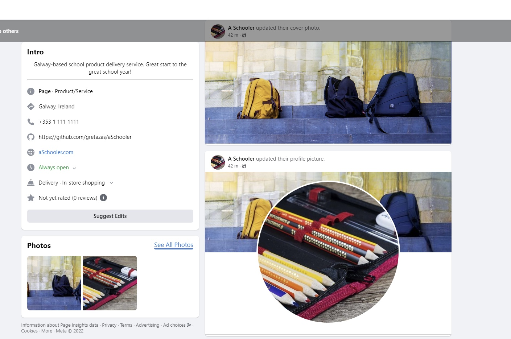
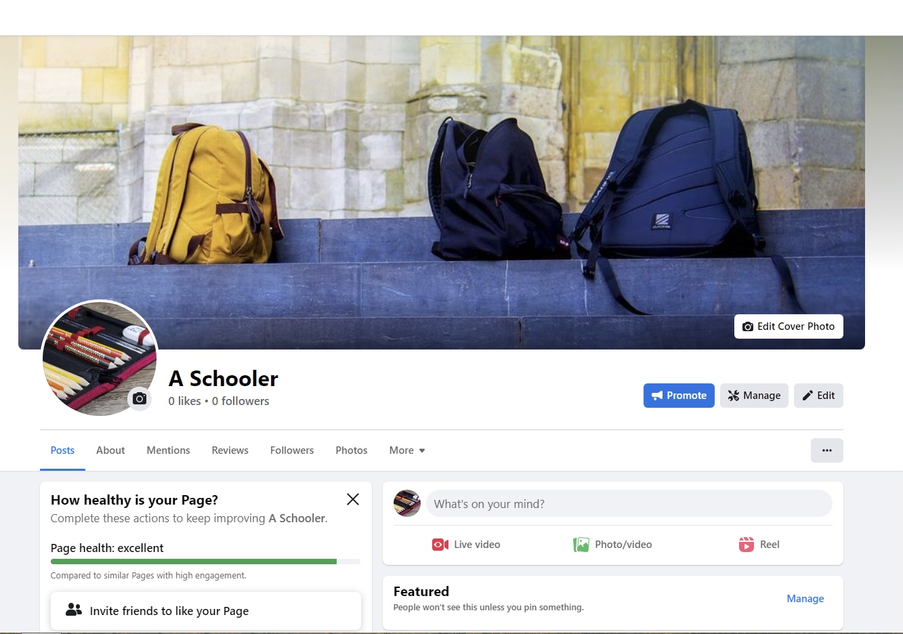

### Subscriptions 

### Business model documentation

- Business description:
    The alphaSchooler site sells bags, folders, notebooks, and copies for school. Stationery for offices and schools. Get ready for school in no time with some right clicks on aSchooler website.
- Detailed products and services:
    The site sells copies for schools and folders for schools or offices. Stationery products. Delivery is a way to get your ordered goods.
- Potential buyers:
    The site would attract students, people who work in offices, and people who need stationery, notebooks, and folders.
- Price range:

    From 0.99€ to 201.99€. Mostly good quality bags would cost the most. When costumer spends 50 euros or more, the delivery is free. 
### SEO Optimization

- For Googles search engine:

    - I Googled similar products fields and:

    - Created meta tags with a description keywords.
    - Made use of good semantics.
    - Customed image names to the subject of the image using `alt` attribute.
    - Contented of the site matches the purpose.
    - Created `sitemap.xml` file.
    - Created `robots.txt` file.

- Keywords:
    - School items, school products, stationary, office, company suplies, school bags, paper, folders,  organisation suplies, math set, art suplies, pencils, markers.
    

    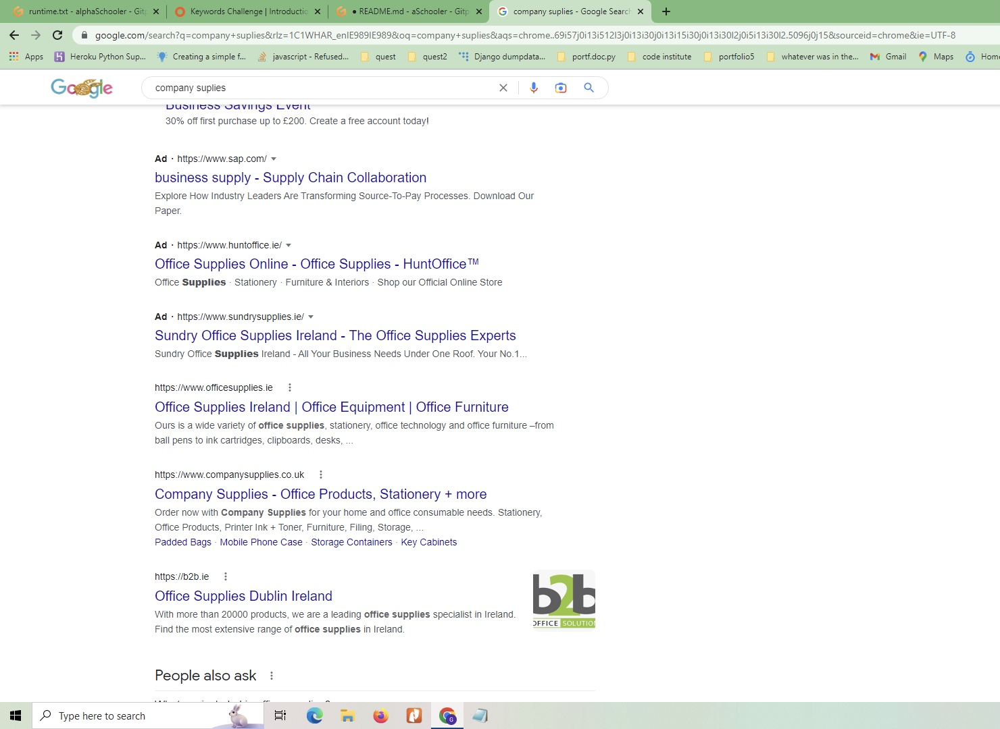

## Stripe payments

## Testing

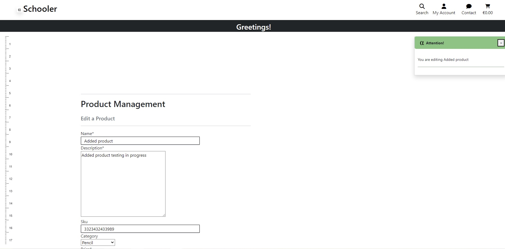
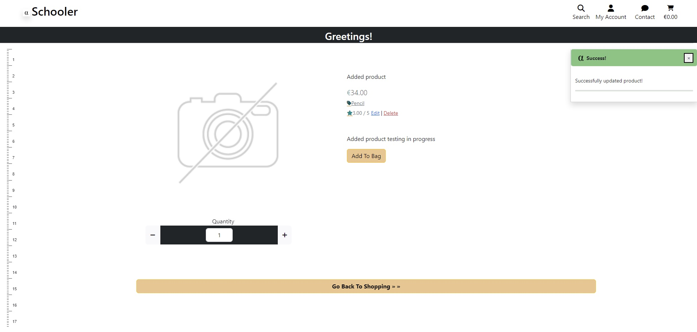
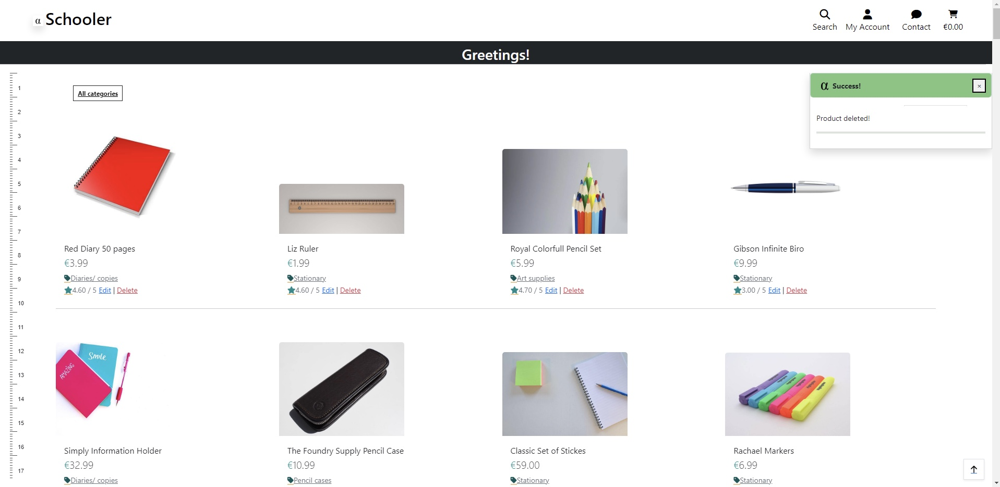

### Automated Testing

* TestCase

#### Django Coverage report

### Manual Testing

### Pep8 and Pylint Python Validators

### HTML Validation with Official W3C Validator

### CSS Validation with Official W3C Validator

(<a href="#top">Back to top</a>)

### LightHouse testing

### Responsive testing

## Bugs

- Product import in rate app and Rating import in Product app. Circular import bug.
    - Tried to import products.models and go around with it.
    - Solution: imported Product in the Ratings function.

- Heroku deployment failed: added- python_version<"3.9" to backports.zoneinfo==0.2.1;

(<a href="#top">Back to top</a>)

## Deployment

Deployment procedure (using Heroku):

### Deployment on Heroku

- Create a Heroku app within Heroku.
- Give project "alfaSchooler" name
- Set Postgres database on Heroku.
- Create an env.py file in your root directory and import the os library within this file.
- Within your env.py file, create environment variables for your DATABASE_URL and SECRET_KEY.
- Assign a values to DATABASE_URL and SECRET_KEY and within the Heroku settings tab, create corresponding Config Variables.
- Set `ALLOWED_HOSTS` in settings.py
- Run migrations for the new Postgres database.
- Heroku configurations.
- Create Procfile to tell Heroku to create a web dyno which will run gunicorn and serve our Django app.
- Push all changes and attempted the initial deployment on Heroku.
- Heroku builds the app, if the built is successful.

### Heroku Deployment - Setting up AWS

- Set Amazon Web Services S3 - cloud based storage service - for storing static and media files.
    - Create a new bucket to store files.
    - Make publicly accessible..
    - New endpoint.
    - Set access between the Heroku app and S3 bucket.
    - Bucket policy section access policy generator to create a security policy.
    - Copy the ARN paste into the ARN box, add the statement and generated a policy.
    - Copy this policy into the bucket policy editor.
    - I proceeded to the access control list section and set the list objects permission for everyone under the Public Access section.
    - Create a group.
    - Import pre-built policy.
    - Attach the policy to the group.
    - Created a user.
    - Download the CSV file with users access key and secret access key.
    - Create a new folder "media" for all media files.
    - Grant public read access to these objects.
- Install boto3 and django-storage.
- Set settings.py with a statement: if there's an environment variable called `USE_AWS` in the environment. 
    - Define the bucket name, the AWS region name, the access key and secret access key 
    - Keep access key and secret access hiding in environment variables.
    - Create a string to tell Django location of static files, containing the AWS S3 bucket name to generate the appropriate URL.
    - Set static file storage and the location.
    - Set imports.
    - Set the default file storage/ media files locations.
    - Set the URLs for static and media files using the custom domain and the new locations.
    - Add  `AWS_S3_OBJECT_PARAMETERS`.
    - 
- In Heroku add the AWS keys to the configuration variables.
    - Remove the collect static variable from config vars.
    - Add stripe keys to the Heroku config vars.
    - Add the URL `/checkout/WH`.
    - Add webhooks signing secret to the Heroku config vars.

- Stripe webpage.
    - Add a new webhook endpoint.

## MVT Architecture

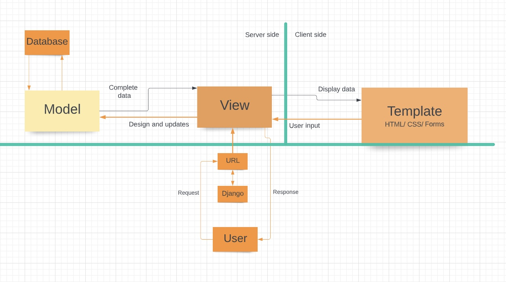

## Django AdminUser
- Ability to view:
    - purchased orders
    - user info
    - product ratings
- Ability to change /add/edit/delete products on page and in admin panel

## Used Technologies
* HTML
* CSS
* Python
* JavaScript

## Frameworks and Libraries used
* Django with;
    * gunicorn
    * psycopg2
    * postgresql
    * AllAuth
    * Crispy Forms
    * colorfield
* Bootstrap

## A word from me

These past two portfolios were difficult for me, but with this portfolio I learned alot. Even though there are so many things not done , I spent a lot of time debugging myself and learnt a lot of new information. Most importangly I have learnt, while debugging not to look for solution, but understand what is causing the issue. 

## Credits
  

- [temp-mail.org](https://temp-mail.org/en/)
- [miniwebtool.com](https://miniwebtool.com/django-secret-key-generator/)
- [XML-Sitemaps.com](https://www.xml-sitemaps.com/)
- [Privacy Policy Generator](https://www.privacypolicygenerator.info/)
- [CSS tricks](https://css-tricks.com/snippets/css/css-triangle/)

![Safe](https://img.shields.io/badge/Stay-Safe-red?logo=data:image/svg%2bxml;base64,PHN2ZyBpZD0iTGF5ZXJfMSIgZW5hYmxlLWJhY2tncm91bmQ9Im5ldyAwIDAgNTEwIDUxMCIgaGVpZ2h0PSI1MTIiIHZpZXdCb3g9IjAgMCA1MTAgNTEwIiB3aWR0aD0iNTEyIiB4bWxucz0iaHR0cDovL3d3dy53My5vcmcvMjAwMC9zdmciPjxnPjxnPjxwYXRoIGQ9Im0xNzQuNjEgMzAwYy0yMC41OCAwLTQwLjU2IDYuOTUtNTYuNjkgMTkuNzJsLTExMC4wOSA4NS43OTd2MTA0LjQ4M2g1My41MjlsNzYuNDcxLTY1aDEyNi44MnYtMTQ1eiIgZmlsbD0iI2ZmZGRjZSIvPjwvZz48cGF0aCBkPSJtNTAyLjE3IDI4NC43MmMwIDguOTUtMy42IDE3Ljg5LTEwLjc4IDI0LjQ2bC0xNDguNTYgMTM1LjgyaC03OC4xOHYtODVoNjguMThsMTE0LjM0LTEwMC4yMWMxMi44Mi0xMS4yMyAzMi4wNi0xMC45MiA0NC41LjczIDcgNi41NSAxMC41IDE1LjM4IDEwLjUgMjQuMnoiIGZpbGw9IiNmZmNjYmQiLz48cGF0aCBkPSJtMzMyLjgzIDM0OS42M3YxMC4zN2gtNjguMTh2LTYwaDE4LjU1YzI3LjQxIDAgNDkuNjMgMjIuMjIgNDkuNjMgNDkuNjN6IiBmaWxsPSIjZmZjY2JkIi8+PHBhdGggZD0ibTM5OS44IDc3LjN2OC4wMWMwIDIwLjY1LTguMDQgNDAuMDctMjIuNjQgNTQuNjdsLTExMi41MSAxMTIuNTF2LTIyNi42NmwzLjE4LTMuMTljMTQuNi0xNC42IDM0LjAyLTIyLjY0IDU0LjY3LTIyLjY0IDQyLjYyIDAgNzcuMyAzNC42OCA3Ny4zIDc3LjN6IiBmaWxsPSIjZDAwMDUwIi8+PHBhdGggZD0ibTI2NC42NSAyNS44M3YyMjYuNjZsLTExMi41MS0xMTIuNTFjLTE0LjYtMTQuNi0yMi42NC0zNC4wMi0yMi42NC01NC42N3YtOC4wMWMwLTQyLjYyIDM0LjY4LTc3LjMgNzcuMy03Ny4zIDIwLjY1IDAgNDAuMDYgOC4wNCA1NC42NiAyMi42NHoiIGZpbGw9IiNmZjRhNGEiLz48cGF0aCBkPSJtMjEyLjgzIDM2MC4xMnYzMGg1MS44MnYtMzB6IiBmaWxsPSIjZmZjY2JkIi8+PHBhdGggZD0ibTI2NC42NSAzNjAuMTJ2MzBoMzYuMTRsMzIuMDQtMzB6IiBmaWxsPSIjZmZiZGE5Ii8+PC9nPjwvc3ZnPg==)

  
(<a href="#top">Back to top</a>)

