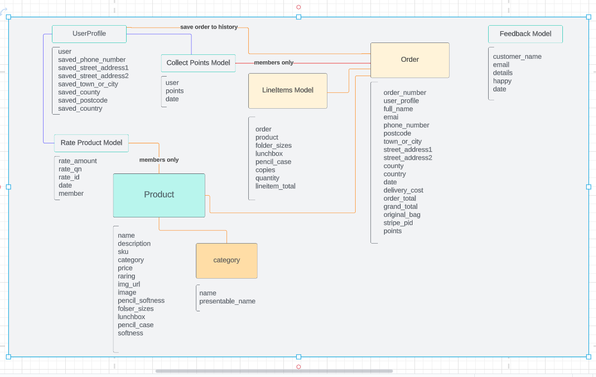
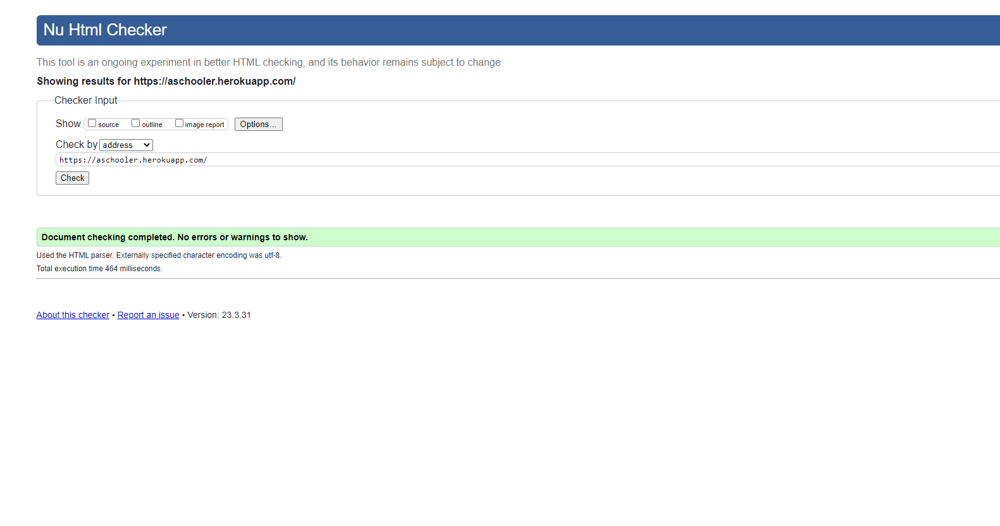
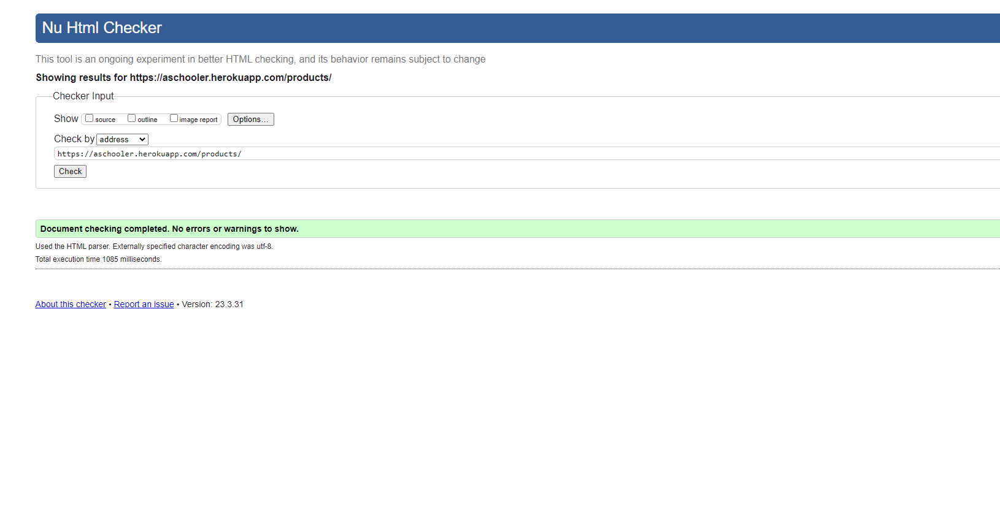
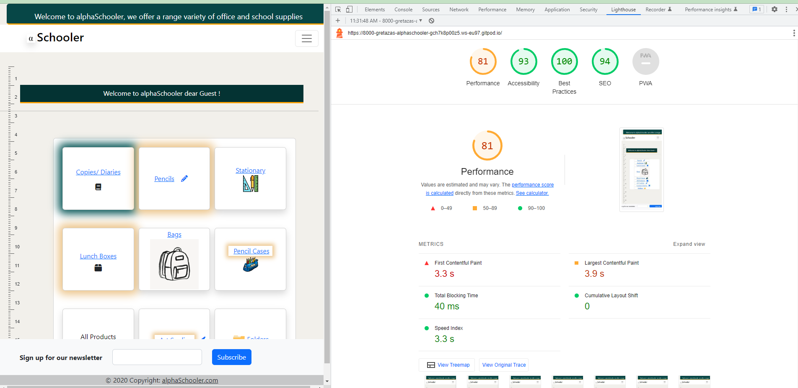

## Introduction
Link to gitHub:
<a href="https://github.com/gretazas/aSchooler">https://github.com/gretazas/aSchooler</a>

## Table of Contents
* [Project Planning](#project-planning)
* [Agile](#agile)
    * [User Stories](#user-stories)
    * [Project Scope](#project-scope)
    * [Project Database Scope](#project-database-scope)
    * [Project Setup](#project-setup)
    * [Project Management](#project-management)
* [Features](#features)
    * [Products](#products)
    * [Create An Account](#create-an-account)
    * [Create an order](#create-an-order)
    * [View an order](#view-an-order)
    * [View Your order history](#view-your-order-history)
    * [Delete Items](#delete-items)
    * [Create Your Profile](#create-your-profile)
    * [Edit Your Profile shipping details](#edit-your-profile-shipping-details)
    * [Admin](#admin)
* [Features - Features Left To Implement](#features-left-to-implement)
* [Basic Wireframe Design](#basic-wireframe-design)
    * [Landing Page Wireframe](./extrareadme.md)
    * [Products Page Wireframe](./extrareadme.md)
    * [Product Detail Page Wireframe](./extrareadme.md)
    * [Shopping Cart Wireframe](./extrareadme.md)
    * [Mix And Match Products Wireframe](./extrareadme.md)
                
* [Kanban Example](#kanban-example)
* [Web Marketing](#web-marketing)
* [Business model documentation](#Business-model-documentation)
* [SEO Optimization](#seo-optimization)
* [Stripe payments](#stripe-payments)
* [Testing](#testing)
    * [Automated Testing](#automated-testing)
    * [Django Coverage report](#django-coverage-report)
    * [Manual Testing](#manual-testing)
    * [Pep8 and Pylint Python Validators](#pep8-and-pylint-python-validators)
    * [HTML Validation with Official W3C Validator](#html-validation-with-official-w3c-validator)
    * [CSS Validation with Official W3C Validator](#css-validation-with-official-w3c-validator)
    * [LightHouse testing](#lighthouse-testing)
    * [Responsive testing](#responsive-testing)
* [Bugs](#bugs)
* [Existing Bugs](#existing-bugs)
* [Deployment](#deployment)
* [Deployment on Heroku](#deployment-on-heroku)
* [Heroku Deployment - Setting up AWS](#heroku-deployment---setting-up-aws)
* [MVT Architecture](#mvt-architecture)
* [Django AdminUser](#django-adminuser)
* [Used Technologies](#used-technologies)
* [Frameworks and Libraries used](#frameworks-and-libraries-used)
* [Credits](#credits)

## Project Planning

* Create wireframes as sketches.
    -   Imagination realization

* Create wireframes with figma.com
    -   Imagination realization in digital

* Create user stories
    -   To get an idea of site usage purposes and features

* Create some parts of readme.md file
    -   To get mentor's approval to start the project

* Create this project plan
    -   Get a straight idea of what to do and when

* Create a new repository on GitHub
    -   Use Code Institute`s  full template

* Start project
    -   Initial Commit

* Use user stories creating project as guidance
    -   Easy to organize work with and commit messages

* Have access to secure checkout.
    -   Using Stripe.

* Admin access to all products, orders, and shipping details.
    -   Admin access allows you to view orders.

## Agile

- Link below you will show wireframe design:
    * [Basic Wireframe Design](./extrareadme.md)
- Link below you will show kanban in git pictures:  
    * [Kanban Example](./kanban.md)

## User Stories

* Viewing and navigation

    * As a Shopper I can View a list of products so that I can Select some to purchase
    * As a Shopper I can View individual product details so that I can Find out about the product price, product itself, rating, view image, search for right sizes
    * As a Shopper I can Easy view the total of all purchases at all times so that I can Easy to see how close I am to the spending limit

* Registration and User Accounts
    * As a Site User I can Register to the Account so that I can Have a personal account i can view my profile, order history, saved shipping and billing details
    * As a Site Member I can Easy to login or logout so that I can Access my personal account information
    * As a Site Member  I can Easily recover  password so that I can Recover access to my account if needed 
    * As a Site Member I can Receive an email conformation after registering so that I can have reinsurance that registration was successful

* Sorting and searching
    * As a Shopper I can Sort the list of products so that I can Easily identify the best-rated products, and sort them by preference 
    * As a Shopper I can Sort specific categories of product so that I can Find best priced or best-rated products
    * As a Shopper I can Find the product by name or description so that I can Find specific product to purchase
    * As a Shopper I can Easily see what I've searched for and how many items found
    * As a Site Member I can access the page with the matching feature so that I can compare in-color products to match them

* Purchasing and Checkout
    * As a Shopper I can Easily select the size and quantity of the product when purchasing it so that I can Ensure I've selected the right products
    * As a Shopper I can Have access to secure checkout so that I can feel safe and pay with ease

# Project Scope

# Project Database Scope

## Product/Category Model:

##  Order/LineItems Model:

## Feedback Model:

## Rate Product Model:

## Collect Points Model:

(<a href="#top">Back to top</a>)

## Project Setup

Creating the basic idea and designing some basic structure, setting up:

- Install Django
- Create new Django project
- Install Django Allauth
- Create a requirements.txt file
- Create a directory for storing all of the required and customised Django allauth templates.
- Create the MVT Architecture(pictures provided).
- Add Django and supporting libraries
- Installed Django.
- Create new Django project
- Create new blank Django project and name it farm_fresh.
- Migrate changes to database after creating the project
- Django Allauth
- Required Django Allauth settings added
- Backend, 'allauth.account.auth_backends.AuthenticationBackend', in the setting.py .
- Backend, 'django.contrib.auth.backends.ModelBackend'.
- The contrib.sites app and the site _id setting I added to the setting.py.

## Project Management
GitHub's KanBan board to manage my workflow. 
* Three columns:
    - todo
    - in progress
    - done

The board allowed me to easily drag my stories through the business delivery lifecycle of: To Do -> In Progress -> Completed.

## Features

View different greetings on different time of the year:
    Import:
        - datetime
        - pandas as pd
            - start = datetime.datetime.strptime("01-12-2021", "%d-%m-%Y")
            - end = datetime.datetime.strptime("07-12-2021", "%d-%m-%Y")
            - date_generated = pd.date_range(start, end)
                - Greatings according to season:
                - if September f"Back to School!"
                - elif December f"Happy Christmas!!!"
                - elif February f"Happy Valentine`s Day!"
                - elif March/april f"Happy Easter!"
                - elif August f"Sale! 10% off with any purchase!"
                - else f"delivery free with purchase of {{ FRE_DELIVERY_TRESHOLD}}€!"

### Products
- Filter products by categories 
- View product detail
- Rate product
- Save product purchase history
- Save purchased product saving points histopy

### Create An Account
- Create save account with email varification.

### Create an order
- Create and order after clicking checkout and see them in profile later.

### View an order
- View your order and collect points history in profile page

### View Your order history
Users have an ability to view their own order history.

### Delete Items
By setting your quantity to 0 user deletes the item from the order line items.

(<a href="#top">Back to top</a>)

### Create Your Profile
- Create account for ability to rate product
- Save points, one point per one euro from every purchase
- Save information for next purchase itme

### Edit Your Profile shipping details
- Easily edit profile information save from earlier

## Features left to implement
- Login via social media account, eg. facebook or google.

(<a href="#top">Back to top</a>)

### Basic Wireframe Design

* [Basic Wireframe Design](./extrareadme.md)

### Kanban Example

(<a href="#top">Back to top</a>)

(<a href="#agile">Back to Agile</a>)

# Web Marketing

- Web marketing is the process of using the Internet to market your business. It includes the use of social media, search engines, blogging, videos, and email. Promoting a business takes effort. There are a variety of ways to do it:

## Facebook  

## Tiktok

## Subscriptions  

## Business model documentation

- Business description:
    The alphaSchooler site sells bags, folders, notebooks, and copies for school. Stationery for offices and schools. Get ready for school in no time with some right clicks on aSchooler website.
- Detailed products and services:
    The site sells copies for schools and folders for schools or offices. Stationery products. Delivery is a way to get your ordered goods.
- Potential buyers:
    The site would attract students, people who work in offices, and people who need stationery, notebooks, and folders.
- Price range:

    From 0.99€ to 201.99€. Mostly good quality bags would cost the most. When costumer spends 50 euros or more, the delivery is free. 
### SEO Optimization

- For Googles search engine:

    - I Googled similar products fields and:

    - Created meta tags with a description keywords.
    - Made use of good semantics.
    - Customed image names to the subject of the image using `alt` attribute.
    - Contented of the site matches the purpose.
    - Created `sitemap.xml` file.
    - Created `robots.txt` file.

- Keywords:
    - School items, school products, stationary, office, company suplies, school bags, paper, folders,  organisation suplies, math set, art suplies, pencils, markers.
    

    

## Stripe payments

No error into the card error div and the status of the payment intent comes back as succeeded, the form to be submitted.
When a user submits their payment information, the order is created in the database and the user is redirected to a success page.
If the order form isn't valid, a message letting the user know will appear and the user will be sent back to the checkout page with the form errors shown.
Webhooks and a webhook handler helps the users to redo the order, if somehow costumer closes the browser window after the payment is confirmed but before the form is submitted we end up with a payment in stripe and an order in our database.

## Testing

## Automated Testing

* TestCase

### Django Coverage report

# Manual Testing

- After creating the alphaSchooler project in Gitpod, I tested it buy running the application and recieved visual confirmation that the application is working successfully from Django.
     
    - After installing Django allauth, I manually tested logging in and out of the admin site. I added settings in settings.py:  
    - ACCOUNT_AUTHENTICATION_METHOD = 'username_email' 
    - ACCOUNT_EMAIL_VERIFICATION = 'mandatory' 
    - ACCOUNT_EMAIL_REQUIRED = True 
    - ACCOUNT_SIGNUP_EMAIL_ENTER_TWICE = True 
    - ACCOUNT_USERNAME_MIN_LENGTH = 6 
    - LOGIN_URL = '/accounts/login/' 
    - LOGIN_REDIRECT_URL = '/' 

- Log in as admin. Get success toast “Successfully signed in as admin.”

- After finalising the Django allauth installation I manually went to the accounts login page and tested the authentication by redirecting a successfull login to a "success" url.

- Log in and check if the greetings changed. 

- When template created, I would manually test that they are working and displaying as intended.

- Sort by… check diff sorting.

- After products.html view was created I manually tested if the context, containing products and their attributes were displaying as expected, confirming that the views, URL's and and templates are all working as planned.

- Go to the pencils category in index.html select pencil, go to product_detail.html add the product to the bag and check for success toast if softness is mentioned. 

- Change softness and increase quantity, check if all are visible in the success toast. 

- Go to copies/diaries and select one of the products, select the size, and again check the functionality. 

- Same check-in stationery category, bags, and other categories. 

- Creating the product detail tamplate- manually tested that all links to individual products and product images worked and that the shop now button worked as intended. All worked as expected.

- Once the logic was in place for the search bar functionality, it was tested by running multiple search queries with search terms that were either in the products names or descriptions and checking the results.

- The shopping cart view, it's URL's and template, links in the base.html template, run the server and all the links are working as planned.

- After adding the increment and decrementing buttons to the various pages, I manually tested and adjusted their operation.

- After creating the success toast, I manually added a product to the cart and tested its operation. Worked!

- Checkout tested by adding items to the cart, processing a test checkout payment, checking that the form is submitted and testing that the checkout_success page was working as expected.

- I did a test log in and logout and found that the standard Allauth templates did not function well and started with their customisation thereafter.

- Rate and get success toast and rate again and get attention toast rated already.

- Go to feedback through the nav bar and submit the form. Get the toast.

- In the contact page press the “Go to shopping button”.

- For users to update their profile with new information. All working!

- Mix and match page and scroll in columns, click on diff items to check if brings me to product_detail.html. Then add to bag.  

- Order history link with order number on the profile pages order history section I was redirected to the information of the specific order.

- In the shopping bag change the product`s quantity and update, and get a toast message. Remove item.

- Add items to the cart, and go to secure checkout.  See the points button, since it's more than grand total. Purchase with points. Fill up the checkout form.

- Go to secure checkout, and fill details. 

- Webhook handler of the checkout app, to handle the form submision if for some reason the checkout view fails. The users order history also updated and got saved to the users profile.

- I worked with add, edit and delete products.To make sure all code is in order.

## Pep8 and Pylint Python Validators

## HTML Validation with Official W3C Validator

## CSS Validation with Official W3C Validator

(<a href="#top">Back to top</a>)

## LightHouse testing

- To add comment: pictures in last picture were compressed at <a href="https://tinypng.com/" target="_blank">https://tinypng.com/</a>

# Responsive testing

## Bugs

- Product import in rate app and Rating import in Product app. Circular import bug.
    - Tried to import products.models and go around with it.
    - Solution: imported Product in the Ratings function.

- Heroku deployment failed: added- python_version<"3.9" to backports.zoneinfo==0.2.1;

* Existing bug: this specific item only.
    TypeError at /bag/add/105/, argument of type 'int' is not iterable. 
    /workspace/alphaSchooler/bag/views.py in add_to_bag
        if 'items_by_size' not in bag[item_id]: 

(<a href="#top">Back to top</a>)

## Deployment

Deployment procedure (using Heroku):

### Deployment on Heroku

- Create a Heroku app within Heroku.
- Give project "alfaSchooler" name
- Set Postgres database on Heroku.
- Create an env.py file in your root directory and import the os library within this file.
- Within your env.py file, create environment variables for your DATABASE_URL and SECRET_KEY.
- Assign a values to DATABASE_URL and SECRET_KEY and within the Heroku settings tab, create corresponding Config Variables.
- Set `ALLOWED_HOSTS` in settings.py
- Run migrations for the new Postgres database.
- Heroku configurations.
- Create Procfile to tell Heroku to create a web dyno which will run gunicorn and serve our Django app.
- Push all changes and attempted the initial deployment on Heroku.
- Heroku builds the app, if the built is successful.

### Heroku Deployment - Setting up AWS

- Set Amazon Web Services S3 - cloud based storage service - for storing static and media files.
    - Create a new bucket to store files.
    - Make publicly accessible..
    - New endpoint.
    - Set access between the Heroku app and S3 bucket.
    - Bucket policy section access policy generator to create a security policy.
    - Copy the ARN paste into the ARN box, add the statement and generated a policy.
    - Copy this policy into the bucket policy editor.
    - I proceeded to the access control list section and set the list objects permission for everyone under the Public Access section.
    - Create a group.
    - Import pre-built policy.
    - Attach the policy to the group.
    - Created a user.
    - Download the CSV file with users access key and secret access key.
    - Create a new folder "media" for all media files.
    - Grant public read access to these objects.
- Install boto3 and django-storage.
- Set settings.py with a statement: if there's an environment variable called `USE_AWS` in the environment. 
    - Define the bucket name, the AWS region name, the access key and secret access key 
    - Keep access key and secret access hiding in environment variables.
    - Create a string to tell Django location of static files, containing the AWS S3 bucket name to generate the appropriate URL.
    - Set static file storage and the location.
    - Set imports.
    - Set the default file storage/ media files locations.
    - Set the URLs for static and media files using the custom domain and the new locations.
    - Add  `AWS_S3_OBJECT_PARAMETERS`.
    - 
- In Heroku add the AWS keys to the configuration variables.
    - Remove the collect static variable from config vars.
    - Add stripe keys to the Heroku config vars.
    - Add the URL `/checkout/WH`.
    - Add webhooks signing secret to the Heroku config vars.

- Stripe webpage.
    - Add a new webhook endpoint.

## MVT Architecture

## Django AdminUser
- Ability to view:
    - purchased orders
    - user info
    - product ratings
- Ability to change /add/edit/delete products on page and in admin panel

## Used Technologies
* HTML
* CSS
* Python
* JavaScript

## Frameworks and Libraries used
* Django with;
    * gunicorn
    * psycopg2
    * postgresql
    * AllAuth
    * Crispy Forms
    * colorfield
* Bootstrap

## A word from me

These past two portfolios were difficult for me, but with this portfolio I learned a lot. Even though there are so many things not done , I spent a lot of time debugging myself and learnt a lot of new information. Most importangly I have learnt, while debugging not to look for solution, but understand what is causing the issue. 

## Credits
  

- [temp-mail.org](https://temp-mail.org/en/)
- [miniwebtool.com](https://miniwebtool.com/django-secret-key-generator/)
- [XML-Sitemaps.com](https://www.xml-sitemaps.com/)
- [Privacy Policy Generator](https://www.privacypolicygenerator.info/)
- [CSS tricks](https://css-tricks.com/snippets/css/css-triangle/)
- [iColor Palette](https://icolorpalette.com/web-orange)

![Safe](https://img.shields.io/badge/Stay-Safe-red?logo=data:image/svg%2bxml;base64,PHN2ZyBpZD0iTGF5ZXJfMSIgZW5hYmxlLWJhY2tncm91bmQ9Im5ldyAwIDAgNTEwIDUxMCIgaGVpZ2h0PSI1MTIiIHZpZXdCb3g9IjAgMCA1MTAgNTEwIiB3aWR0aD0iNTEyIiB4bWxucz0iaHR0cDovL3d3dy53My5vcmcvMjAwMC9zdmciPjxnPjxnPjxwYXRoIGQ9Im0xNzQuNjEgMzAwYy0yMC41OCAwLTQwLjU2IDYuOTUtNTYuNjkgMTkuNzJsLTExMC4wOSA4NS43OTd2MTA0LjQ4M2g1My41MjlsNzYuNDcxLTY1aDEyNi44MnYtMTQ1eiIgZmlsbD0iI2ZmZGRjZSIvPjwvZz48cGF0aCBkPSJtNTAyLjE3IDI4NC43MmMwIDguOTUtMy42IDE3Ljg5LTEwLjc4IDI0LjQ2bC0xNDguNTYgMTM1LjgyaC03OC4xOHYtODVoNjguMThsMTE0LjM0LTEwMC4yMWMxMi44Mi0xMS4yMyAzMi4wNi0xMC45MiA0NC41LjczIDcgNi41NSAxMC41IDE1LjM4IDEwLjUgMjQuMnoiIGZpbGw9IiNmZmNjYmQiLz48cGF0aCBkPSJtMzMyLjgzIDM0OS42M3YxMC4zN2gtNjguMTh2LTYwaDE4LjU1YzI3LjQxIDAgNDkuNjMgMjIuMjIgNDkuNjMgNDkuNjN6IiBmaWxsPSIjZmZjY2JkIi8+PHBhdGggZD0ibTM5OS44IDc3LjN2OC4wMWMwIDIwLjY1LTguMDQgNDAuMDctMjIuNjQgNTQuNjdsLTExMi41MSAxMTIuNTF2LTIyNi42NmwzLjE4LTMuMTljMTQuNi0xNC42IDM0LjAyLTIyLjY0IDU0LjY3LTIyLjY0IDQyLjYyIDAgNzcuMyAzNC42OCA3Ny4zIDc3LjN6IiBmaWxsPSIjZDAwMDUwIi8+PHBhdGggZD0ibTI2NC42NSAyNS44M3YyMjYuNjZsLTExMi41MS0xMTIuNTFjLTE0LjYtMTQuNi0yMi42NC0zNC4wMi0yMi42NC01NC42N3YtOC4wMWMwLTQyLjYyIDM0LjY4LTc3LjMgNzcuMy03Ny4zIDIwLjY1IDAgNDAuMDYgOC4wNCA1NC42NiAyMi42NHoiIGZpbGw9IiNmZjRhNGEiLz48cGF0aCBkPSJtMjEyLjgzIDM2MC4xMnYzMGg1MS44MnYtMzB6IiBmaWxsPSIjZmZjY2JkIi8+PHBhdGggZD0ibTI2NC42NSAzNjAuMTJ2MzBoMzYuMTRsMzIuMDQtMzB6IiBmaWxsPSIjZmZiZGE5Ii8+PC9nPjwvc3ZnPg==)

  
(<a href="#top">Back to top</a>)

